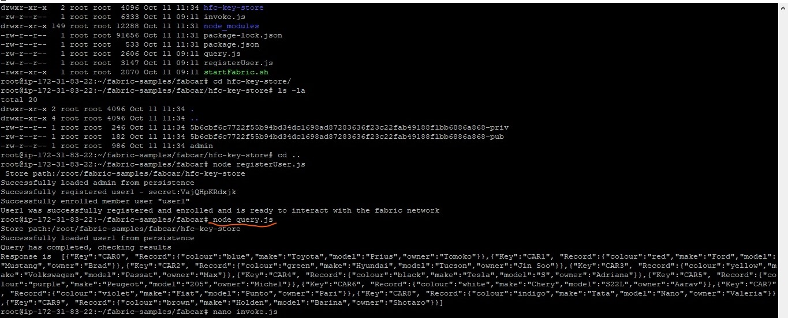

Hyperledger 
========

---
**NOTE**

 "Hyperledger is an open sourced community of communities to benefit an ecosystem of Hyperledger based solution providers and users focused on blockchain related use cases that will work across a variety of industrial sectors.
  – Brian Behlendorf, Executive Director of Hyperledger." 
 
---

## Hyperledger Setup

#### install Curl

1.sudo apt-get install curl

#### install go language

2.sudo apt-get install golang-go  

#Setup Go Path  

3.export GOPATH=$HOME/go  

4.export PATH=$PATH:$GOPATH/bin  

#### Install Docker for Ubuntu

 **Docker-ce** - Base package which makes all the necessary files available for the docker container to run properly.  
 
 **Docker-compose**- Base package which makes all the necessary files available for the docker container to run properly.  
 

5.curl -fsSL https://download.docker.com/linux/ubuntu/gpg | sudo apt-key add - 

 
6.sudo add-apt-repository "deb [arch=amd64] https://download.docker.com/linux/ubuntu $(lsb_release -cs) stable"

 
7.sudo apt-get update

 
8.apt-cache policy docker-ce

  
9.sudo apt-get install -y docker

 
10.sudo apt-get install docker-compose

 
11.sudo systemctl status docker
  
  
#Check Docker Version

12.docker-compose --version

#Running Docker Daemon

13.dockerd

#### Install node.js and npm  

curl sL https://deb.nodesource.com/setup_8.x | sudo -E bash -  

#Check node version and NPM version
$ node -version  
$ npm -version  

####  Enter the fabric-samples directory and install the platform specific binaries
$ cd fabric-samples  
$ curl -sSL https://goo.gl/byy2Qj | bash -s 1.0.5  

If everything goes well you will see the above output on your screen.  
To have a look on the download binaries execute the following from your terminal:  
$ cd bin  
$ ls  

Enter into the first-network directory  
$ cd ../  
$ cd first-network  
$ ls  

Generate the required certificates and articates for your first network  
$ ./byfn.sh -m generate  

To see the generate certificates use the following command:  
$ ls  
$ cd crypto-config  
$ ls  

Create your first network using the following command  
$ cd ../    
$ ./byfn.sh -m up  

Check the generates images and running containers using the following command:  
$ docker images  
$ docker ps  

To bring down the created network executed the following command  
$ ./byfn.sh -m down  

You can check the created images have been removed using the following:  
$ docker images  

 Move to the fabcar directory  
$ cd ../  
$ ls  
$ cd fabcar  

 Install the node modules using the following command  
$ sudo npm install  

Install grpc module for communication with Hyperledger Fabric using the following command:  
$ sudo npm install grpc  

Start the Hyperledger Fabric network for fabcar by executing the following command:  
$ ./startFabric.sh  

To enroll the users firstly you have to enroll an Admin that will help to enroll other users with
Hyperledger Fabric network of Fabcar.  
$ node enrollAdmin.js  

You can find the private and public key for admin using the following  
$ ls  
$ cd hfc-key-store/  
$ ls  

Enroll the user to query and invoke fabcar network (As Hyperledger Fabric is a permissioned
blockchain that is why firstly we have to register the user using its certificate)  
$ cd ../  
$ node registerUser.js  

Query the Fabcar network using the following command (To access the ledger state)  
$ node query.js  

